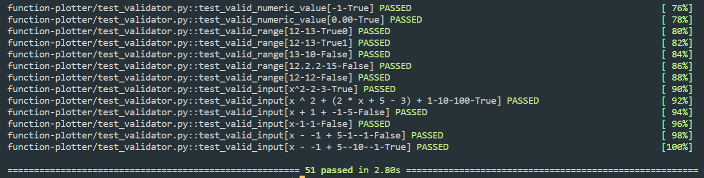

# Function Plotter

[](https://www.gnu.org/licenses/gpl-3.0)
[](https://www.python.org/)

A GUI python project that allows you to draw graphs also has validation for user input.

## Installation

Clone the repo and install dependencies with python package manger pip

```bash
git clone https://github.com/omarfareed/function-plotter
cd function-plotter/
sudo pip3 install -r requirements.txt
```

For Windows

```bash
pip install -r requirements.txt
```

## Usage

### run the application

```bash
python application.py
```

### test the application

```bash
pytest -v
```

#### Test Result



## Features

1. drawing the graph
2. determine the range you want

## Snapshots

### Validation

#### Empty fields


#### Wrong Input Values

##### Wrong Range


##### Invalid Range Values


##### Wrong Expression


### Plotting


